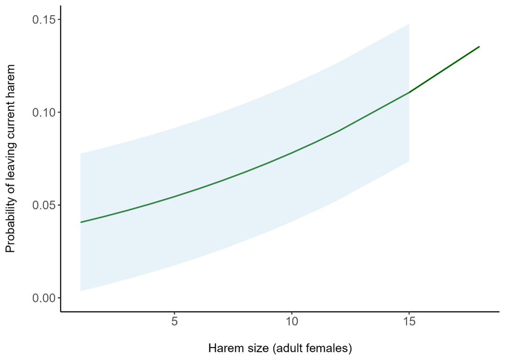

# Drivers of mare group choice in Przewalski's horses
Code and key results for my undergrad dissertation (2024 February - April)

## Summary
Rewilding initiatives increasingly incorporate reintroducing large grazers such as horses into 
ecosystems. Acquiring an understanding of behavioural and social dynamics of candidate 
species for rewilding is of broad importance to aid conservation and management. Horses 
generally live in stable breeding groups called harems, formed by a male, multiple females and 
their offspring. Being part of such a group has wide-ranging benefits for both sexes, however, 
some studies report significant variation in the stability of these core social units. Here, I 
investigated drivers of social instability, as defined by female harem changing behaviour, in a 
population of Przewalski’s horses (Equus ferus Przewalskii) using 15 years of group 
composition data with a notably fine temporal resolution with mixed-effects logistic models.  I found that reproductive parameters, 
particularly current pregnancy from the harem stallion, are paramount to maintaining social 
stability, with a stronger effect in young females compared to older ones. Offspring birth and 
survival is also an important driver of females to stay in their current group. Younger females 
generally had a higher probability of changing harems, and larger harems were more likely to 
be deserted than smaller ones. The importance of successful reproduction in maintaining 
social stability and cohesion, and the significant sensitivity of harem groups to various 
parameters investigated call for a re-evaluation of current management tools commonly 
implemented to control wild horse populations such as contraception, and highlight the need 
to acquire a more thorough understanding of equid behaviour. 

## Key Results
### Mares who are pregnant (a) or are nursing a foal (b) are more likely to stay in their groups.

Age-specific effects of reproductive success as determined by a) pregnancy and b) a surviving foal. Bars show predicted probabilities, and error bars show 95% confidence intervals based on estimates of the final model (GLMM for binomial data, n(observations) = 2063, n(individuals) = 261, see Appendix 3  for model estimates and Appendix 1 for calculations.)

### Mares who are in larger groups are more likely to leave their group.

Relationship between harem size and the probability of changing groups in female Przewalski’s horses. The line shows model predictions (Effect size (on the log-odds scale, variable scaled): 0.187, SE = 0.046, see Appendix 3 ), and blue shaded area shows 95% confidence interval. Due to very few data points for harem size > 14 (see Appendix 2 for visual represetation), CI could not be accurately computed for this region.

## Code
[This](diss_code.R) script is the one I used to construct my variables and models.

[This](example_cleaner_code) is an example script of how I cleaned the field data for analysis.

